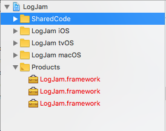

# Building Cross-Platform Universal Frameworks using Swift

This multipart article covers the steps Appracatappra uses to create Universal Framework projects in Swift that will support iOS, tvOS, watchOS and macOS, all while sharing as much common code as possible. 

There are several ways to achieve this goal with Swift in Xcode and there have been many articles already written on this subject. So, why am I creating another? I have two main reasons:

1. Since we are creating frameworks meant to be sold (or released for free) to 3rd party developers, I've made many tweaks to the process to support this. These include building a trial and release version of the framework, creating an install package and creating full API documentation.
2. Currently, there are quite a few steps and I wanted to document them so I didn't forget.

That said, I'd like to stress this point again; mine is not the only way to achieve this goal and it might not be the best way but, it works for me. Hopefully, you can find my modifications useful as well.

This article contains the following sections:

* [Building Cross-Platform Universal Frameworks using Swift](#)
	* [A Word on ABI Stability](#A-Word-on-ABI-Stability)
	* [Why Build A Framework?](#Why-Build-A-Framework)
* [Creating the Universal Framework Project](#Creating-the-Universal-Framework-Project)
	* [Creating the Main Project](#Creating-the-Main-Project)
	* [Adding an iOS Target](#Adding-an-iOS-Target)
	* [Adding a tvOS Target](#Adding-a-tvOS-Target)
	* [Adding a macOS Target](#Adding-a-macOS-Target)
* [Adding Code and Sharing it Cross-Platform](#Adding-Code-and-Sharing-it-Cross-Platform)
	* [Adding API Documentation Comments](#Adding-API-Documentation-Comments)
	* [Adding Platform Specific Code](#Adding-Platform-Specific-Code)
		* [Using #if...#endif](#Using-if-endif) 
		* [Using Specific Target Membership Files](#Using-Specific-Target-Membership-Files)
* [Packaging the Universal Framework](#Packaging-the-Universal-Framework)
	* [Adding an iOS Package](#Adding-an-iOS-Package) 
		* [Creating the Universal iOS Library](#Creating-the-Universal-iOS-Library) 
		* [Creating the iOS API Documentation](#Creating-the-iOS-API-Documentation)
	* [Adding a tvOS Package](#Adding-a-tvOS-Package) 
		* [Creating the Universal tvOS Library](#Creating-the-Universal-tvOS-Library) 
		* [Creating the tvOS API Documentation](#Creating-the-tvOS-API-Documentation)
	* [Adding a macOS Package](#Adding-a-macOS-Package)
		* [Creating the macOS Library](#Creating-the-macOS-Library)
		* [Creating the macOS API Documentation](#Creating-the-macOS-API-Documentation)
	* [Setting the Packages to Build the Release Version of the Framework](#Setting-the-Packages-to-Build-the-Release-Version-of-the-Framework)
* [Up Next](#Up-Next)

I found much of the information for this article scattered throughout the internet, so another point of this article is to pull it all together in one place. I'll give credit and link back to the original source articles, so you can look at different ways of structuring your projects to fit your own needs.

<a name="A-Word-on-ABI-Stability"></a>
## A Word on ABI Stability

Before we continue on, I need to bring up the topic of Swift ABI stability and why it is important when you are creating a framework in Swift.

First, what is ABI Stability? ABI stands for **Application Binary Interface** and, just like an API does for source code, it provides the protocol that allows code written is Swift to call pre-compiled libraries. As of this writing, Swift 4 has not reached ABI Stability, so a precompiled framework written in Swift 4 can **only** be used by an app written in Swift 4.

Swift 5 (which is planned to be released later this year) has the goal of achieving [ABI Stability](https://www.theregister.co.uk/2017/08/09/apple_swift_v5/). Until then, the app and the precompiled framework must be a matched set as far as which version of Swift they are written and compiled in.

<a name="Why-Build-A-Framework"></a>
## Why Build A Framework?

Given the state of ABI Stability and Swift 4, why would you want to build a framework in the first place? One reason is if you plan on selling or releasing the framework to 3rd party developers without exposing the source (like we do). Another is to share common code across app projects while maintaining one copy. Yet another is to hide sensitive processes from in-house developers while allowing them access.

There are many, valid reasons and, as long as you remember to match the app and the framework Swift versions, the current process works quite well.

<a name="Creating-the-Universal-Framework-Project"></a>
# Creating the Universal Framework Project

Since the goal is to create different versions of the framework that support all of Apple's OSes (or as many as your project requires), runs on both the simulators and real hardware and shares as much code as possible, we will be creating one project with several targets in Xcode.

For the sake of this example, we will create the **LogJam** library that writes the given message to the output inspector log in Xcode and supports iOS, tvOS and macOS.

This section is based off of the information from [TofPlay/SwiftCrossPlatformFramework](https://github.com/TofPlay/SwiftCrossPlatformFramework), [Xcode & cross-platform frameworks](http://ilya.puchka.me/xcode-cross-platform-frameworks/) and [How to make a Swift framework?](https://theswiftdev.com/2017/10/23/how-to-make-a-swift-framework/).

<a name="Creating-the-Main-Project"></a>
## Creating the Main Project

Start Xcode, and select **File** > **New** > **Project...** Next, select **Cross-platform** and **Empty**:


Click the **Next** button, provide a **Project Name**, click **Next** again and select a location to save the project:


<a name="Adding-an-iOS-Target"></a>
## Adding an iOS Target

With the main project created, next we need to add the targets for all of the Apple OSes that we want to support with the framework. We will end up repeating these steps for each OS. With the project selected in the **Project Navigator**, click the **+** button at the bottom of the **Project and Targets** list:


Choose **iOS** > **Cocoa Touch Framework** and click **Next**:


Use the same name as the main project but append ` iOS` and click the **Finish** button:


Next, remove `_iOS` from the **Bundle Identifier**:


If we left things at this point, the framework that would be created would be called `LogJam_iOS.framework` and the namespace that would need to import would be `LogJam_iOS`, for example:

```swift
import Foundation
import LogJam_iOS
...
```

Which is not what we had in mind for a cross-platform framework. To fix this issue, select the **Build Settings** tab, scroll down to the **Packaging** section and double-click the **Project Name** setting and change it to `${PROJECT_NAME}`:


With this done the `LogJam iOS` target will compile a `LogJam.framework` and use the `LogJam` namespace.

<a name="Adding-a-tvOS-Target"></a>
## Adding a tvOS Target

At this stage, we will basically repeat the steps above to add a tvOS version. Add a new **Target**, choose **tvOS** > **TV Framework** and click **Next**:


Use the same name as the main project but append ` tvOS` and click the **Finish** button:


Next, remove `_tvOS` from the **Bundle Identifier**:


Select the **Build Settings** tab, scroll down to the **Packaging** section and double-click the **Project Name** setting and change it to `${PROJECT_NAME}`:


<a name="Adding-a-macOS-Target"></a>
## Adding a macOS Target

Repeat the steps again to add the macOS Target. Add a new **Target**, choose **macOS** > **Cocoa Framework** and click **Next**:


Use the same name as the main project but append ` macOS` and click the **Finish** button:


Next, remove `_macOS` from the **Bundle Identifier**:


Select the **Build Settings** tab, scroll down to the **Packaging** section and double-click the **Project Name** setting and change it to `${PROJECT_NAME}`:


<a name="Adding-Code-and-Sharing-it-Cross-Platform"></a>
# Adding Code and Sharing it Cross-Platform

One of the main goals of this exercise is to share as much of the code as possible across the different OS versions of the framework. Let's add a folder to the project to hold all of the shared code. Right-click on the project name in the **Project Navigator** and select **New Group**, enter the name `SharedCode`:



For our example framework, lets add a single class that will be shared across all platforms to handle writing to the log file. Right-click on the `SharedCode` folder and select **New File...** > **iOS** > **Swift File**:


Click the **Next** button, set the **Save As** name to `Logger.swift`, ensure that the `LogJam iOS`, `LogJam tvOS` and `LogJam macOS` Targets are selected and click the **Create** button:


By selecting the `LogJam iOS`, `LogJam tvOS` and `LogJam macOS` Targets, the `Logger.swift` file will be compiled for all targets. If you need to change the targets later, select the file in the **Project Navigator** and set the **Target Membership** under the **File Inspector**:


<a name="Adding-API-Documentation-Comments"></a>
## Adding API Documentation Comments

Next, we'll add the following code to the `Logger.swift` file and decorate it with comments for our API documentation:

```swift
//
//  Logger.swift
//  LogJam
//
//  Created by Kevin Mullins on 3/21/18.
//

import Foundation

/**
 Records the given message in the system log.
 
 ```swift
 import LogJam
 ...
 
 Logger.record("Log this message")
 ```
 */
public class Logger {
    
    /**
     Records the given message in the system log.
     
     ```swift
     import LogJam
     ...
     
     Logger.record("Log this message")
     ```
     
     - Parameter text: The message to record.
    */
    public static func record(_ text: String) {
        print(text)
    }
    
}
```

APPCODA has an excellent article on [Documenting Your Swift Code in Xcode Using Markdown](https://www.appcoda.com/swift-markdown/) so I won't reproduce that work here. With these comments in place, a developer consuming this framework can get **Quick Help** on any feature by ALT-Clicking on a function:


Latter, we will be using Realm's [Jazzy](https://github.com/realm/jazzy) to generate professional looking API documentation from these comments.

<a name="Adding-Platform-Specific-Code"></a>
## Adding Platform Specific Code

There are two main mechanisms for adding platform-specific code to your framework projects: 1) by including code in `#if...#endif` compiler instructions, 2) by adding a new file and selecting a specific **Target Membership** (as show above).

<a name="Using-if-endif"></a>
### Using #if...#endif

For simple changes, you can add `#if os(target)...#endif` compiler instructions to specify your platform specific code where `target` is one of the following:

* `iOS`
* `watchOS`
* `tvOS`
* `macOS`

For example:

```swift
/// Returns `true` if the app is running in Apple CarPlay, else returns `false`.
public static var isCar: Bool {
    #if os(watchOS) || os(macOS)
        return false
    #else
        return UIDevice.current.userInterfaceIdiom == .carPlay
    #endif
}
```

Again, I don't suggest this for large sections of code or for multiple, overlapping sections because it can make the code difficult to read and maintain.

<a name="Using-Specific-Target-Membership-Files"></a>
### Using Specific Target Membership Files

For large, complex changes create a new file under the specific **Target** group in the **Project Navigator**. Take the example of our macOS specific code in our [Action Utilities](http://appracatappra.com/products/action-utilities/) framework:


The `ColorExtension.swift` file holds all of the macOS specific code and the file belongs to the `ActionUtilities macOS` **Target Membership**:


This isolates the macOS in a single file making it easier to read and maintain. From here you can either have the full code of the require piece or use **Extensions** (`extension`) to add OS specific functionality.

<a name="Packaging-the-Universal-Framework"></a>
# Packaging the Universal Framework

To this point, we have added the targets and code to build and test our framework for all of the supported Apple OSes and set the groundwork for building our API documentation.

When we have the framework ready to ship, we will need a way to build a Universal Framework that will work on both real hardware and the simulators (for iOS, tvOS and watchOS), a way to create both trial and release version (if selling the framework) and a way to create our final API documentation.

The information for this section came from the [Build a Universal Framework for iOS using Swift](https://medium.com/swiftindia/build-a-custom-universal-framework-on-ios-swift-549c084de7c8) article.

<a name="Adding-an-iOS-Package"></a>
## Adding an iOS Package

The first thing we need to do when creating a package is to compile both an iOS Simulator version of the framework and a iOS hardware version and combine them together using the `lipo` command.

Select the project from the **Project Navigator** and add a new **Target**. Select **Cross-platform** > **Aggregate** and click **Next**:


Enter `Package iOS` for the **Product Name** and click **Finish**:


<a name="Creating-the-Universal-iOS-Library"></a>
### Creating the Universal iOS Library

We will need to use a Shell Script to compile the two different version of the framework and combine them into one. The script I use is a heavily modified version from the [Build a Universal Framework for iOS using Swift](https://medium.com/swiftindia/build-a-custom-universal-framework-on-ios-swift-549c084de7c8) article that support making a trail or release version as well.

With the `Package iOS` target selected, go to the **Build Phases** tab, click the **+** button at the top to add a new phase and select **New Run Script Phase**. Double-click the new phases section tile and rename it `Make Universal Library`:


Next, add the following script:

```sh
#!/bin/sh

# Step 1: Define Macros
RELEASE_TYPE=""
FRAMEWORK_VERSION="NOTRIAL_VERSION"

# Step 2: Define OS and directories
UNIVERSAL_TARGET="iOS"
UNIVERSAL_OUTPUTFOLDER=${BUILD_DIR}/${CONFIGURATION}-universal-${UNIVERSAL_TARGET}
UNIVERSAL_FRAMEWORKFOLDER=${PROJECT_NAME}${RELEASE_TYPE}/${UNIVERSAL_TARGET}
DEVICE_OS="iphoneos"
DEVICE_SIMULATOR="iphonesimulator"

# Step 3: Make sure the output directories exists
mkdir -p "${UNIVERSAL_OUTPUTFOLDER}"
mkdir -p "${UNIVERSAL_FRAMEWORKFOLDER}"

# Step 4: Build Device and Simulator versions
# See: https://developer.apple.com/legacy/library/documentation/Darwin/Reference/ManPages/man1/xcodebuild.1.html
xcodebuild -target "${PROJECT_NAME} ${UNIVERSAL_TARGET}" ONLY_ACTIVE_ARCH=NO -configuration ${CONFIGURATION} -sdk ${DEVICE_OS}  BUILD_DIR="${BUILD_DIR}" BUILD_ROOT="${BUILD_ROOT}" OTHER_SWIFT_FLAGS="-D ${FRAMEWORK_VERSION}" clean build
xcodebuild -target "${PROJECT_NAME} ${UNIVERSAL_TARGET}" VALID_ARCHS="x86_64 i386" -configuration ${CONFIGURATION} -sdk ${DEVICE_SIMULATOR} ONLY_ACTIVE_ARCH=NO BUILD_DIR="${BUILD_DIR}" BUILD_ROOT="${BUILD_ROOT}" OTHER_SWIFT_FLAGS="-D ${FRAMEWORK_VERSION}" clean build

# Step 5: Copy the framework structure (from iphoneos build) to the universal folder
cp -R "${BUILD_DIR}/${CONFIGURATION}-${DEVICE_OS}/${PROJECT_NAME}.framework" "${UNIVERSAL_OUTPUTFOLDER}/"

# Step 6: Copy Swift modules from iphonesimulator build (if it exists) to the copied framework directory
SIMULATOR_SWIFT_MODULES_DIR="${BUILD_DIR}/${CONFIGURATION}-${DEVICE_SIMULATOR}/${PROJECT_NAME}.framework/Modules/${PROJECT_NAME}.swiftmodule/."
if [ -d "${SIMULATOR_SWIFT_MODULES_DIR}" ]; then
cp -R "${SIMULATOR_SWIFT_MODULES_DIR}" "${UNIVERSAL_OUTPUTFOLDER}/${PROJECT_NAME}.framework/Modules/${PROJECT_NAME}.swiftmodule"
fi

# Step 7: Create universal binary file using lipo and place the combined executable in the copied framework directory
lipo -create -output "${UNIVERSAL_OUTPUTFOLDER}/${PROJECT_NAME}.framework/${PROJECT_NAME}" "${BUILD_DIR}/${CONFIGURATION}-${DEVICE_SIMULATOR}/${PROJECT_NAME}.framework/${PROJECT_NAME}" "${BUILD_DIR}/${CONFIGURATION}-${DEVICE_OS}/${PROJECT_NAME}.framework/${PROJECT_NAME}"

# Step 8: Convenience step to copy the framework to the project's directory
cp -R "${UNIVERSAL_OUTPUTFOLDER}/${PROJECT_NAME}.framework" "${UNIVERSAL_FRAMEWORKFOLDER}/"

# Step 9: Convenience step to open the project's directory in Finder
# open "${UNIVERSAL_FRAMEWORKFOLDER}/"

# Step 10: Testing
# open "${UNIVERSAL_OUTPUTFOLDER}"
```

Let's break down what's going on here. 

#### Step 1: Define Macros

The first two variables are to support trial verses release version of the framework. For us, we use the following for release versions:

```sh
# Step 1: Define Macros
RELEASE_TYPE=""
FRAMEWORK_VERSION="NOTRIAL_VERSION"
```

And this version for trials:

```sh
# Step 1: Define Macros
RELEASE_TYPE="Trial"
FRAMEWORK_VERSION="TRIAL_VERSION"
```

`RELEASE_TYPE` is added to the name of the folder that gets built containing the final build versions of the framework (one for each OS). `FRAMEWORK_VERSION` is passed as a macro definition during compilation that can be tested for using the following code:

```swift
#if TRIAL_VERSION
	ACNotify.showMessage(text: "Appracatappra ADSQLParser Trial")
#endif
```

#### Step 2: Define OS and directories

`UNIVERSAL_TARGET` is the human readable name of the sub folder that will be built and must match the prefix we added to each of the project Targets. `UNIVERSAL_OUTPUTFOLDER` is the name of the temporary folder that will hold the Universal Framework as it is being built. `UNIVERSAL_FRAMEWORKFOLDER` is the name of the folder that the completed framework will be copied to. `DEVICE_OS` and `DEVICE_SIMULATOR` define the hardware and simulator that the framework is being built for as:

* **iOS** - `iphoneos` and `iphonesimulator`.
* **watchOS** - `watchos` and `watchsimulator`.
* **tvOS** - `appletvos` and `appletvsimulator`.
* **macOS** - `macosx`, macOS does not use the `DEVICE_SIMULATOR` setting.

#### Step 3: Make sure the output directories exists

Ensures that the required folders have been built.

#### # Step 4: Build Device and Simulator versions

Creates the required hardware and simulator versions for the specific project Target with the given prefix (`${PROJECT_NAME} ${UNIVERSAL_TARGET}`). For example `LogJam iOS` for our current project and OS.

#### Step 5: Copy the framework structure from iphoneos build

Copies the results of the iOS hardware specific framework to our temporary build directory.

#### Step 6: Copy the framework structure from iphonesimulator build

Copies the results of the iOS Simulator specific framework to our temporary build directory.

#### Step 7: Create universal binary file

Uses the `lipo` command to combine the hardware and simulator versions of the framework into one, Universal Framework.

#### # Step 8: Copy the framework

Copies the resulting framework into the `UNIVERSAL_FRAMEWORKFOLDER` framework directory specified above.

#### Steps 9 and 10

Can be used for convenience and testing to open the `UNIVERSAL_OUTPUTFOLDER` and `UNIVERSAL_FRAMEWORKFOLDER` framework directories specified above after the build completes.

<a name="Creating-the-iOS-API-Documentation"></a>
### Creating the iOS API Documentation

Click the **+** button at the top to add a new phase and select **New Run Script Phase**. Double-click the new phases section tile and rename it `Build API Documentation`:


Add the following script:

```sh
#!/bin/sh

# Define macros
API_TARGET="iOS"
API_OUTPUT="${PROJECT_DIR}/API/${API_TARGET}"
DEVICE_OS="iphoneos"
ROOT_URL="http://appracatappra.com/api/actionutilities/ios/"

# Make sure the output directory exists
mkdir -p "${API_OUTPUT}"

# Move to project directory
cd "${PROJECT_DIR}"

# Create documentation with Jazzy
jazzy --output "${API_OUTPUT}" --sdk ${DEVICE_OS} --clean --xcodebuild-arguments -target,"${PROJECT_NAME} ${API_TARGET}" --module ${PROJECT_NAME} --author "Appracatappra, LLC" --root-url "${ROOT_URL}"

# Open project directory
# open "${API_OUTPUT}"
```

As stated in the [Adding API Documentation Comments](#Adding-API-Documentation-Comments) section above, this script will use Realm's [Jazzy](https://github.com/realm/jazzy) to generate professional looking API documentation from MarkDown comments in the code. For example:


<a name="Adding-a-tvOS-Package"></a>
## Adding a tvOS Package

Let's repeat the steps to build the iOS Package above. Select the project from the **Project Navigator** and add a new **Target**. Select **Cross-platform** > **Aggregate** and click **Next**:


Enter `Package tvOS` for the **Product Name** and click **Finish**:


<a name="Creating-the-Universal-tvOS-Library"></a>
### Creating the Universal tvOS Library

With the `Package tvOS` target selected, go to the **Build Phases** tab, click the **+** button at the top to add a new phase and select **New Run Script Phase**. Double-click the new phases section tile and rename it `Make Universal Library`. Next, add the following script:

```sh
#!/bin/sh

# Define Macros
RELEASE_TYPE=""
FRAMEWORK_VERSION="NOTRIAL_VERSION"

UNIVERSAL_TARGET="tvOS"
UNIVERSAL_OUTPUTFOLDER=${BUILD_DIR}/${CONFIGURATION}-universal-${UNIVERSAL_TARGET}
UNIVERSAL_FRAMEWORKFOLDER=${PROJECT_NAME}${RELEASE_TYPE}/${UNIVERSAL_TARGET}
DEVICE_OS="appletvos"
DEVICE_SIMULATOR="appletvsimulator"

# Make sure the output directories exists
mkdir -p "${UNIVERSAL_OUTPUTFOLDER}"
mkdir -p "${UNIVERSAL_FRAMEWORKFOLDER}"

# Step 1. Build Device and Simulator versions
# See: https://developer.apple.com/legacy/library/documentation/Darwin/Reference/ManPages/man1/xcodebuild.1.html
xcodebuild -target "${PROJECT_NAME} ${UNIVERSAL_TARGET}" ONLY_ACTIVE_ARCH=NO -configuration ${CONFIGURATION} -sdk ${DEVICE_OS}  BUILD_DIR="${BUILD_DIR}" BUILD_ROOT="${BUILD_ROOT}" OTHER_SWIFT_FLAGS="-D ${FRAMEWORK_VERSION}" clean build
xcodebuild -target "${PROJECT_NAME} ${UNIVERSAL_TARGET}" VALID_ARCHS="x86_64 i386" -configuration ${CONFIGURATION} -sdk ${DEVICE_SIMULATOR} ONLY_ACTIVE_ARCH=NO BUILD_DIR="${BUILD_DIR}" BUILD_ROOT="${BUILD_ROOT}" OTHER_SWIFT_FLAGS="-D ${FRAMEWORK_VERSION}" clean build

# Step 2. Copy the framework structure (from iphoneos build) to the universal folder
cp -R "${BUILD_DIR}/${CONFIGURATION}-${DEVICE_OS}/${PROJECT_NAME}.framework" "${UNIVERSAL_OUTPUTFOLDER}/"

# Step 3. Copy Swift modules from iphonesimulator build (if it exists) to the copied framework directory
SIMULATOR_SWIFT_MODULES_DIR="${BUILD_DIR}/${CONFIGURATION}-${DEVICE_SIMULATOR}/${PROJECT_NAME}.framework/Modules/${PROJECT_NAME}.swiftmodule/."
if [ -d "${SIMULATOR_SWIFT_MODULES_DIR}" ]; then
cp -R "${SIMULATOR_SWIFT_MODULES_DIR}" "${UNIVERSAL_OUTPUTFOLDER}/${PROJECT_NAME}.framework/Modules/${PROJECT_NAME}.swiftmodule"
fi

# Step 4. Create universal binary file using lipo and place the combined executable in the copied framework directory
lipo -create -output "${UNIVERSAL_OUTPUTFOLDER}/${PROJECT_NAME}.framework/${PROJECT_NAME}" "${BUILD_DIR}/${CONFIGURATION}-${DEVICE_SIMULATOR}/${PROJECT_NAME}.framework/${PROJECT_NAME}" "${BUILD_DIR}/${CONFIGURATION}-${DEVICE_OS}/${PROJECT_NAME}.framework/${PROJECT_NAME}"

# Step 5. Convenience step to copy the framework to the project's directory
cp -R "${UNIVERSAL_OUTPUTFOLDER}/${PROJECT_NAME}.framework" "${UNIVERSAL_FRAMEWORKFOLDER}/"

# Step 6. Convenience step to open the project's directory in Finder
# open "${UNIVERSAL_FRAMEWORKFOLDER}/"

# KKM - Testing
# open "${UNIVERSAL_OUTPUTFOLDER}"
```

See the [Creating the Universal iOS Library](#Creating-the-Universal-iOS-Library) section above for the full details of what is going on here.

<a name="Creating-the-tvOS-API-Documentation"></a>
### Creating the tvOS API Documentation

Click the **+** button at the top to add a new phase and select **New Run Script Phase**. Double-click the new phases section tile and rename it `Build API Documentation`. Add the following script:

```sh
#!/bin/sh

# Define macros
API_TARGET="tvOS"
API_OUTPUT="${PROJECT_DIR}/API/${API_TARGET}"
DEVICE_OS="appletvos"
ROOT_URL="http://appracatappra.com/api/actiondata/tvos/"

# Make sure the output directory exists
mkdir -p "${API_OUTPUT}"

# Move to project directory
cd "${PROJECT_DIR}"

# Create documentation with Jazzy
jazzy --output "${API_OUTPUT}" --sdk ${DEVICE_OS} --clean --xcodebuild-arguments -target,"${PROJECT_NAME} ${API_TARGET}" --module ${PROJECT_NAME} --author "Appracatappra, LLC" --root-url "${ROOT_URL}"

# Open project directory
# open "${API_OUTPUT}"
```

See the [Creating the iOS API Documentation](#Creating-the-iOS-API-Documentation) section above for the full details of what is going on here.

<a name="Adding-a-macOS-Package"></a>
## Adding a macOS Package

Again, select the project from the **Project Navigator** and add a new **Target**. Select **Cross-platform** > **Aggregate** and click **Next**:


Enter `Package macOS` for the **Product Name** and click **Finish**:


<a name="Creating-the-macOS-Library"></a>
### Creating the macOS Library

With the `Package macOS` target selected, go to the **Build Phases** tab, click the **+** button at the top to add a new phase and select **New Run Script Phase**. Double-click the new phases section tile and rename it `Make Universal Library`. Next, add the following script:

```sh
#!/bin/sh

# Define Macros
RELEASE_TYPE=""
FRAMEWORK_VERSION="NOTRIAL_VERSION"

UNIVERSAL_TARGET="macOS"
DEVICE_OS="macosx"
UNIVERSAL_FRAMEWORKFOLDER=${PROJECT_NAME}${RELEASE_TYPE}/${UNIVERSAL_TARGET}

# Make sure the output directories exists
mkdir -p "${UNIVERSAL_FRAMEWORKFOLDER}"

# Step 1. Build Device and Simulator versions
# See: https://developer.apple.com/legacy/library/documentation/Darwin/Reference/ManPages/man1/xcodebuild.1.html
xcodebuild -target "${PROJECT_NAME} ${UNIVERSAL_TARGET}" ONLY_ACTIVE_ARCH=NO -configuration ${CONFIGURATION} -sdk ${DEVICE_OS}  BUILD_DIR="${BUILD_DIR}" BUILD_ROOT="${BUILD_ROOT}" OTHER_SWIFT_FLAGS="-D ${FRAMEWORK_VERSION}" clean build


# Step 2. Copy the framework structure (from iphoneos build) to the universal folder
cp -R "${BUILD_DIR}/${CONFIGURATION}/${PROJECT_NAME}.framework" "${UNIVERSAL_FRAMEWORKFOLDER}/"

# Step 3. Convenience step to open the project's directory in Finder
# open "${UNIVERSAL_FRAMEWORKFOLDER}/"

```

See the [Creating the Universal iOS Library](#Creating-the-Universal-iOS-Library) section above for the full details of what is going on here.

<a name="Creating-the-macOS-API-Documentation"></a>
### Creating the macOS API Documentation

Click the **+** button at the top to add a new phase and select **New Run Script Phase**. Double-click the new phases section tile and rename it `Build API Documentation`. Add the following script:

```sh
#!/bin/sh

# Define macros
API_TARGET="macOS"
API_OUTPUT="${PROJECT_DIR}/API/${API_TARGET}"
DEVICE_OS="macosx"
ROOT_URL="http://appracatappra.com/api/actiondata/macos/"

# Make sure the output directory exists
mkdir -p "${API_OUTPUT}"

# Move to project directory
cd "${PROJECT_DIR}"

# Create documentation with Jazzy
jazzy --output "${API_OUTPUT}" --sdk ${DEVICE_OS} --clean --xcodebuild-arguments -target,"${PROJECT_NAME} ${API_TARGET}" --module ${PROJECT_NAME} --author "Appracatappra, LLC" --root-url "${ROOT_URL}"

# Open project directory
# open "${API_OUTPUT}"
```

See the [Creating the iOS API Documentation](#Creating-the-iOS-API-Documentation) section above for the full details of what is going on here.

<a name="Setting-the-Packages-to-Build-the-Release-Version-of-the-Framework"></a>
## Setting the Packages to Build the Release Version of the Framework

The final step is to set all of the Packages to build for Release instead of Debug mode. Click on the **Action Scheme** at the top of Xcode and select **Manage Schemes...**:


Select `Package iOS` and click the **Edit** button:


Set the **Build Configuration** to **Release** and click the **Manage Schemes...** button:


Select `Package tvOS` and click the **Edit** button:


Set the **Build Configuration** to **Release** and click the **Manage Schemes...** button:


Select `Package macOS` and click the **Edit** button:


Set the **Build Configuration** to **Release** and click the **Close** button:


<a name="Up-Next"></a>
# Up Next

In the next part of this article we will cover creating an install package for the completed framework.


