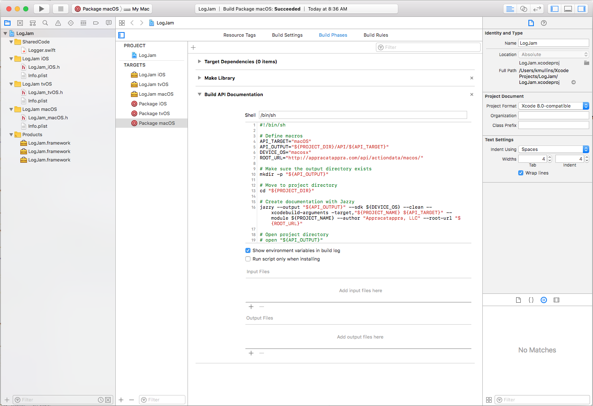
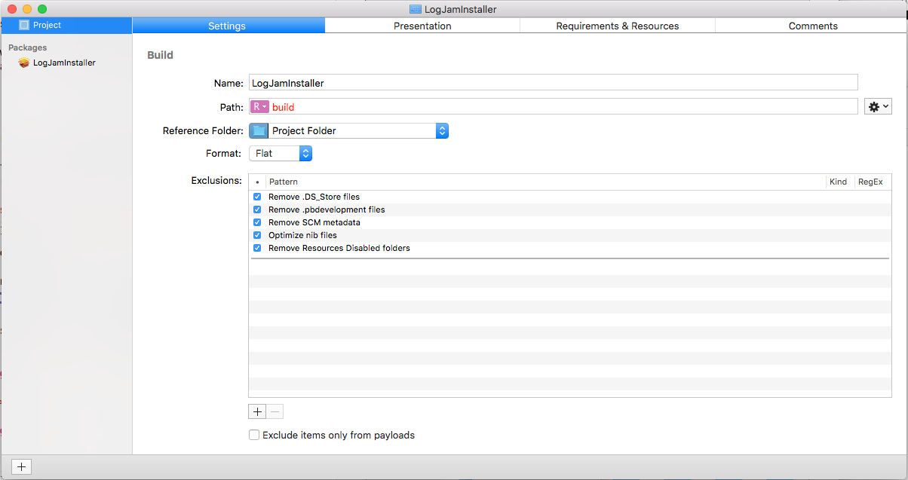

# Cross-Platform Universal Swift Framework Installers

In this second part of our three part article on the steps Appracatappra uses to create **Universal Frameworks** in Swift, we will cover creating an **Installer Package** from our compiled **Universal Frameworks** that includes all of the Apple OSes that the framework supports and places them in the correct locations in the consumer's development computer.

In the first part, [Building Cross-Platform Universal Frameworks using Swift](http://appracatappra.com/2018/03/building-cross-platform-universal-frameworks-using-swift/), we covered the steps to create the **Universal Framework** project, have it support multiple OSes, share as much code as possible across OSes, build the API documentation for each OS version and include both hardware and simulator support for iOS, watchOS and tvOS frameworks.

As I stated in the first part, mine is not the only way to achieve this goal and it might not be the best way but, it works for me and I hope you can find this information useful too.

This article contains the following sections:

* [Building Our Packages](#Building-Our-Packages)
* [Where to Install the Frameworks](#Where-to-Install-the-Frameworks)
* [Creating the Installer Package](#Creating-the-Installer-Package)
	* [Creating the Installer Project](#Creating-the-Installer-Project)
	* [Defining the Installer Presentation](#Defining-the-Installer-Presentation) 
		* [Setting the Title](#Setting-the-Title) 
		* [Setting the Background Image](#Setting-the-Background-Image)
		* [Setting the Introduction Message](#Setting-the-Introduction-Message)
		* [Setting the Read Me Message](#Setting-the-Read-Me-Message)
		* [Setting the License Agreement](#Setting-the-License-Agreement)
	* [Configuring the Installer Package](#Configuring-the-Installer-Package) 
* [Building the Installer Package](#Building-the-Installer-Package)
* [Signing the Installer Package](#Signing-the-Installer-Package)
* [Up Next](#Up-Next)

I found much of the information for this article scattered throughout the internet, so another point of this article is to pull it all together in one place. I’ll give credit and link back to the original source articles, so you can look at different ways of structuring your projects to fit your own needs.

<a name="Building-Our-Packages"></a>
# Building Our Packages

Using the **Universal Framework Project** that we created in the first part of this article, we will need to build each of the **Packages** that we created for each OS that our framework will support:



To do this, click the **Set the active scheme box** at the top of Xcode to the first **Package** and build it:


Repeat the process for each **Package** in the project. When completed, the project's directory will resemble the following, with the final builds in the `LogJam` subdirectory:


The this directory will contain subdirectories for each of the Apple OSes that the framework supports:


Inside each OS type folder is the OS specific version of the framework:


<a name="Where-to-Install-the-Frameworks"></a>
# Where to Install the Frameworks

Now that we have the final framework versions built and ready to ship, there comes the question of where to install them in the client's development computer?

According to the [Installing Your Framework](https://developer.apple.com/library/content/documentation/MacOSX/Conceptual/BPFrameworks/Tasks/InstallingFrameworks.html#//apple_ref/doc/uid/20002261-BBCCFBJA) section of Apple's [Introduction to Framework Programming Guide](https://developer.apple.com/library/content/documentation/MacOSX/Conceptual/BPFrameworks/Frameworks.html#//apple_ref/doc/uid/10000183-SW1) the typical location for public 3rd party frameworks is the `/Library/Frameworks` directory on the developer's computer.

From Apple's documentation:

> For nearly all cases, installing your frameworks in `/Library/Frameworks` is the best choice. Frameworks in this location are discovered automatically by the compiler at compile time and the dynamic linker at runtime. Applications that link to frameworks in other directories, such as `~/Library/Frameworks` or `/Network/Library/Frameworks`, must specify the exact path to the framework at build time so that the dynamic linker can find it. If the path changes (as it might for a user home directory), the dynamic linker may be unable to find the framework.

Now that we know where to place the final frameworks, we need to create an **Install Package** to automate the process.

<a name="Creating-the-Installer-Package"></a>
# Creating the Installer Package

Most of the information for this section came from The Eclectic Light Company's [Making an Installer package the easier way](https://eclecticlight.co/2017/03/08/making-an-installer-package-the-easier-way/) article.

Apple no longer provides a GUI tool for creating **Installer Packages**, but instead relies on a pair of command line tools: `pkgbuild` & `productbuild`. If you want to go this route, I would suggest reading The Grey Blog's [Creating Packages from the Command Line](http://thegreyblog.blogspot.co.uk/2014/06/os-x-creating-packages-from-command_2.html).

That was a bit too much for the simple type of installs required for our **Universal Swift Frameworks**, so we chose to use Stéphane Sudre’s free [Packages](http://s.sudre.free.fr/Software/Packages/about.html) app for macOS. As the The Eclectic Light Company's states, the app is old but works great on High Sierra and is easy to use.

The one thing **Packages** is missing is the ability to sign the final **Installer Package** with the a **Developer ID Installer Certificate**, which is required to allow a consumer to install the package on newer version of macOS.

<a name="Creating-the-Installer-Project"></a>
## Creating the Installer Project

With Packages install, start the app, select **Distribution** as the template type and click the **Next** button:


Enter a **Project Name**:


Click the **Choose...** button, navigate to your **Universal Framework Project** directory, click the **New Folder** button, create a new directory for the installer and choose the new location:


Click the **Create** button and the main project screen of the Installer Project will be displayed:



<a name="Defining-the-Installer-Presentation"></a>
## Defining the Installer Presentation

In this section we will define the look and feel of the **Installer Package** that will be built including the **Title**, **Background Image**, **Introduction Message**, **Read Me** message, **License Agreement** and **Summary** message.

Several of the message section are optional and all of the sections can be localized. For each localization, you will create a file in the **Universal Framework Project** directory in one of the following formats: `TEXT`, `RTF`, `RTFd` or `HTML`. 

<a name="Setting-the-Title"></a>
### Setting the Title

Switch to the **Presentation** tab > **Title** and change the **Title** of the **Install Package** for the given localization:


Use the **+** button at the bottom of the list to add more localizations, if required.

<a name="Setting-the-Background-Image"></a>
### Setting the Background Image

Select **Background** > **Custom Background**:


Under the **Image** dropdown, select **Choose...**, select the image to display and tap the **Choose** button:


Set the **Alignment** to the bottom left hand corner to avoid the text (this is our preference, but select what works for you):


<a name="Setting-the-Introduction-Message"></a>
### Setting the Introduction Message

The **Introduction Message** is the first screen shown by the installer. You will need to create a `TEXT`, `RTF`, `RTFd` or `HTML` file for each localization. 

Select **Introduction** and click the **+** button at the bottom of the list to add a localization:


From the **Localization** dropdown select **Choose...** and pick the source file:


The **Introduction Message** will be displayed:


<a name="Setting-the-Read-Me-Message"></a>
### Setting the Read Me Message

We typically use the **Read Me** message to show what has changed in a new version of our frameworks. You will need to create a `TEXT`, `RTF`, `RTFd` or `HTML` file for each localization.

Select **Read Me** and click the **+** button at the bottom of the list to add a localization:


From the **Localization** dropdown select **Choose...** and pick the source file:


The **Read Me** message will be displayed:


<a name="Setting-the-License-Agreement"></a>
### Setting the License Agreement

Create a **License Agreement** for the type of framework you have created, for example the MIT license. You will need to create a `TEXT`, `RTF`, `RTFd` or `HTML` file for each localization.

Select **License Agreement** and click the **+** button at the bottom of the list to add a localization:


From the **Localization** dropdown select **Choose...** and pick the source file:


The **License Agreement** message will be displayed:


<a name="Configuring-the-Installer-Package"></a>
## Configuring the Installer Package

With the look and feel of the **Installer Package** defined, next we need to configure the package and define what get's installed where. Select the **Package** from the list, the **Setting** tab and enter the **Identifier** and **Version** number:


Next, move the **Payload** tab and set what to install where. Select **Library** > **Frameworks**:


Click the **+** button at the bottom of the list and select the directory where all of the final builds of the frameworks was created, click the **Add** button:


The folder will be added to the location:


Save your changes to the **Installer Project**.

<a name="Building-the-Installer-Package"></a>
# Building the Installer Package

With the **Installer Project** created and configured, we are ready to build our **Installer Package**. From the **Build** menu select **Build** and the results dialog will be displayed:


If everything went correctly, you'll have the completed **Installer Package** in the **Project Installer** Directory under the **Build** directory:


<a name="Signing-the-Installer-Package"></a>
# Signing the Installer Package

To be successfully installed on newer version of macOS, the **Installer Package** will need to be signed with your **Developer ID Installer Certificate** from Apple. This certificate can be created in Xcode under **Preferences** > **Accounts** > **Manage Certificates...** Creating this certificate is beyond the scope of this article, however, you should be able to find plenty of information about the process on the internet.

Your certificate will be in the form "*Developer ID Installer: Company Name (XXXXXXXXX)*" in the **Keychain Access** App under **My Certificates**:


You'll need to know this name exactly to sign the package.

Next, start the Terminal app, and change to the directory where the Installer Package that was build by Packages is:


Next, use the `productsign` command to sign the package with the key by entering the following command:

```sh
sudo productsign --sign "Developer ID Installer: Company Name (XXXXXXXXX)" LogJamInstaller.pkg LogJam.pkg
```

You should see output similar to the following:


And the final installer should be in the **Build** directory:


<a name="Up Next"></a>
# Up Next

In the final installment of this article, we'll show how to install and use the **Universal Swift Framework** on the developer's computer.


