# Using Your Custom Cross-Platform Universal Swift Framework

In this third and final part of our three part article on the steps Appracatappra uses to create **Universal Frameworks** in Swift, we will cover installing and using our custom cross-platform **Universal Swift Framework** on a consumer's development computer.

In the first part, [Building Cross-Platform Universal Frameworks using Swift](http://appracatappra.com/2018/03/building-cross-platform-universal-frameworks-using-swift/), we covered the steps to create the **Universal Framework** project, have it support multiple OSes, share as much code as possible across OSes, build the API documentation for each OS version and include both hardware and simulator support for iOS, watchOS and tvOS frameworks.

The second part, [Cross-Platform Universal Swift Framework Installers](http://appracatappra.com/2018/03/cross-platform-universal-swift-framework-installers/), covers creating an Installer Package from our compiled Universal Frameworks that includes all of the Apple OSes that the framework supports and placing them in the correct locations in the consumer’s development computer.

As I stated in the first two parts, mine is not the only way to achieve this goal and it might not be the best way but, it works for me and I hope you can find this information useful too.

This article contains the following sections:

* [Installing the Framework](#Installing-the-Framework)
* [Consuming the Framework](#Consuming-the-Framework)
	* [Calling the Framework](#Calling-the-Framework) 
* [Updating to a New Version of the Framework](#Updating-to-a-New-Version-of-the-Framework)
* [Shipping an App Using the Framework](#Shipping-an-App-Using-the-Framework)
* [Final Thoughts](#Final-Thoughts)

I found much of the information for this article scattered throughout the internet, so another point of this article is to pull it all together in one place. I’ll give credit and link back to the original source articles, so you can look at different ways of structuring your projects to fit your own needs.

<a name="Installing-the-Framework"></a>
# Installing the Framework

In the last article we created an **Installer Package** from our custom framework that would place our framework in the optimal location on the developer's computer. Any developer wishing to consume the framework need only run the Installer and follow the onscreen instructions:

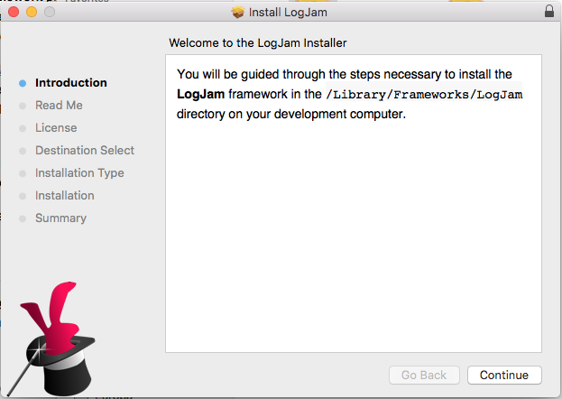

When the Installer finishes, the framework should be in their `/Library/Frameworks` directory:

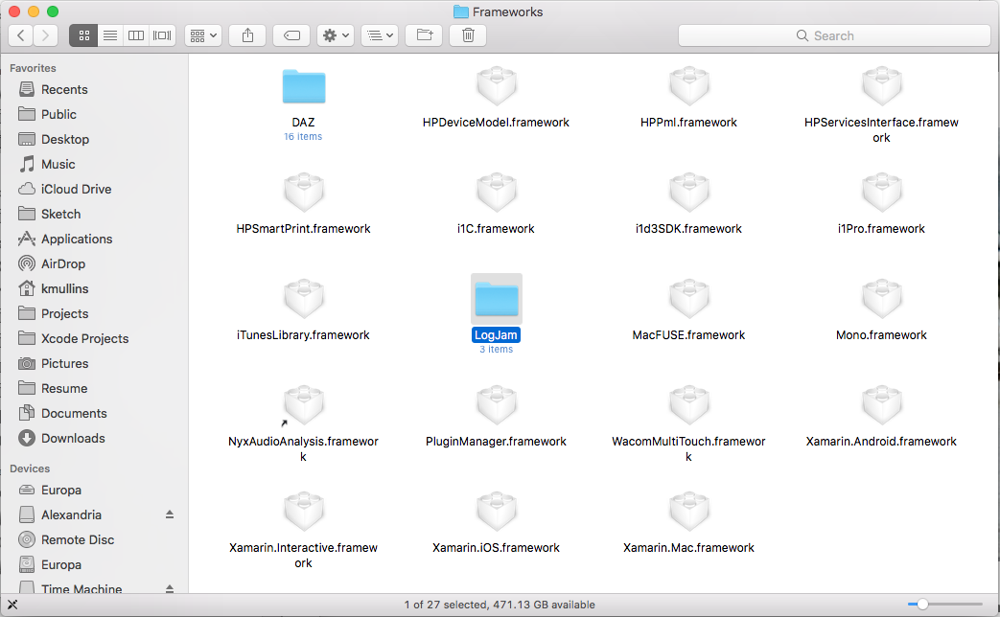

<a name="Consuming-the-Framework"></a>
# Consuming the Framework

To use the framework in an app project, you will need to open or start a new project in Xcode and select the **Project** in the **Project Navigator**:

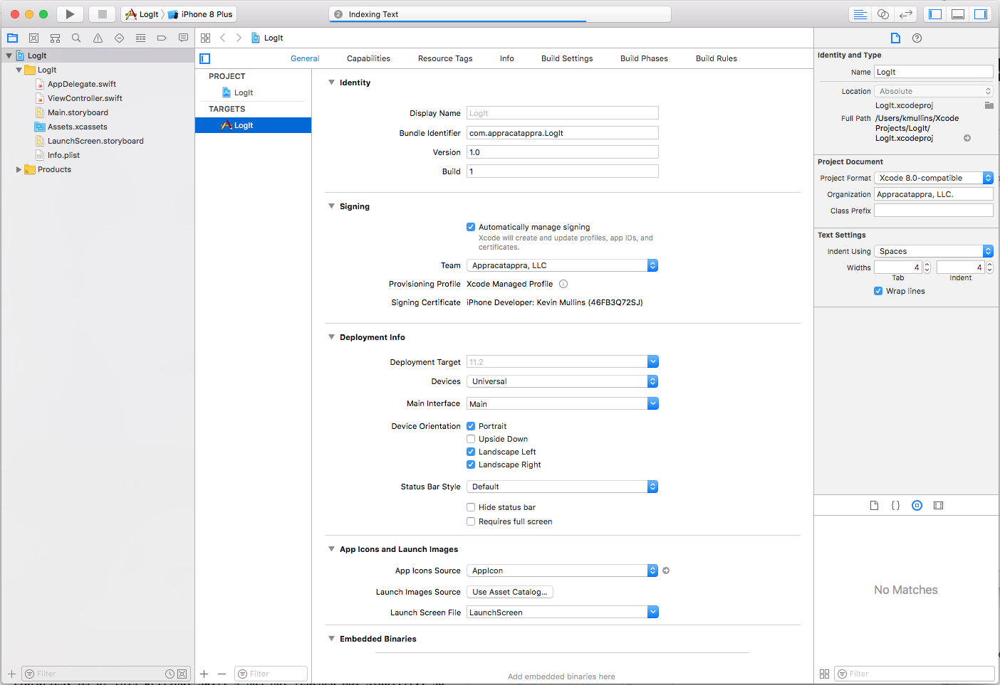

Select the **Target** for the **Project** and scroll down to the **Embedded Binaries** section: 

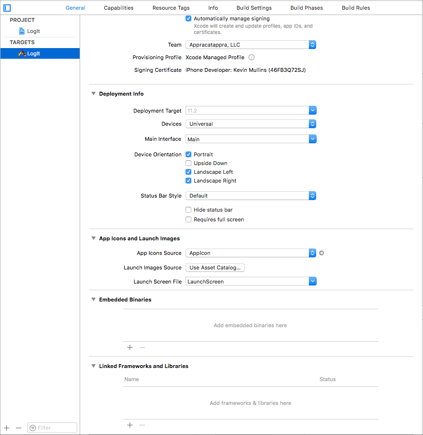

In **Finder**, open the **Library** > **Frameworks** > **LogJam** directory:

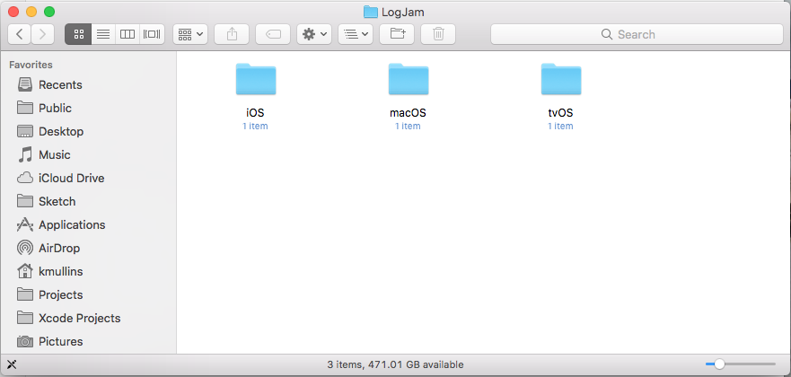

Open the folder corresponding to the OS of **Target** for the app you are currently working on:

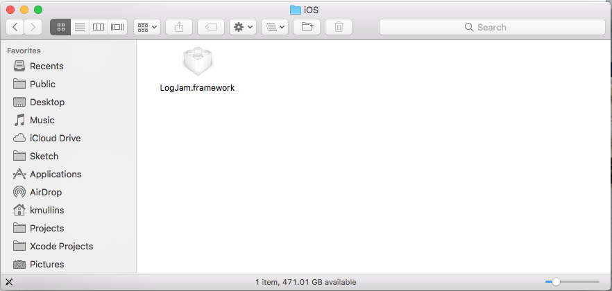

Select the `LogJam.framework` file and drag it into the **Embedded Binaries** section:

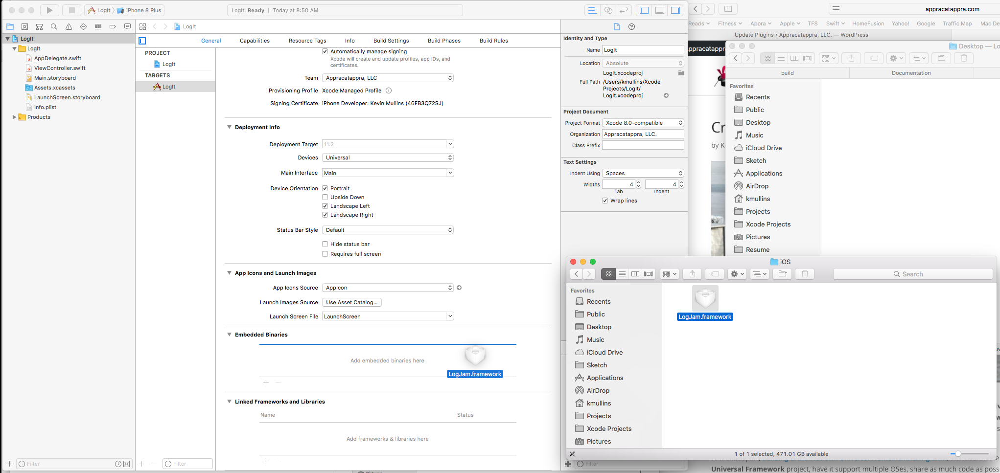

Release the framework over the section and the following dialog box will be displayed:

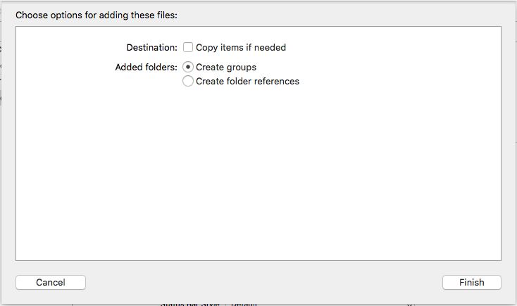

From here you have two choices for the **Destination: [ ] Copy items if needed** option:

* **Checked** - This will place a copy of the current version of the framework in the app project's directory. If a new version of the framework is installed on your machine, this app will always use the currently selected version unless the you delete this copy and use the steps above to select the latest version.
* **Unchecked** - The app project will reference the copy of the framework installed in the `/Library/Frameworks` directory. Since this location is in Xcode's search path, you won't have to add the library's directory to the search path for the linker. If you install a new version, the app will use it instead.

Make the choice based on the needs on your app project and click the Finish button. The framework will be added to both the **Embedded Frameworks** and the **Linked Frameworks and Libraries** sections:

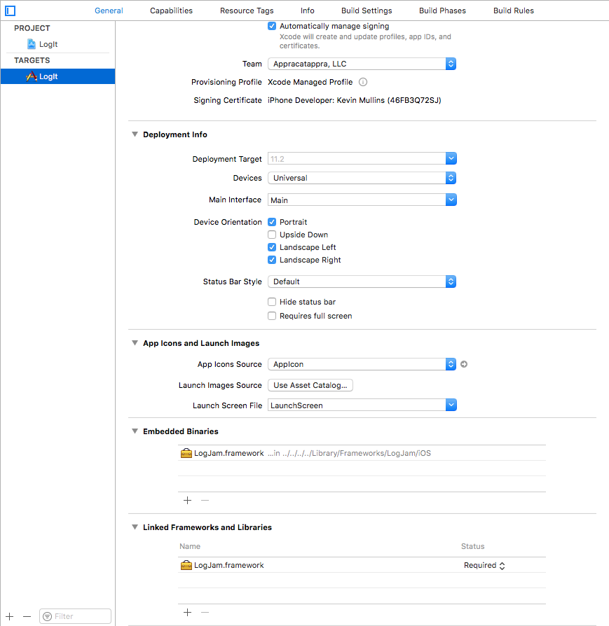

<a name="Calling-the-Framework"></a>
## Calling the Framework

With the framework installed in the app project, add an `import LogJam` statement to the top of any class and call the `Logger`. For example:

```swift
//
//  ViewController.swift
//  LogIt
//
//  Created by Kevin Mullins on 3/23/18.
//  Copyright © 2018 Appracatappra, LLC. All rights reserved.
//

import UIKit
import LogJam

class ViewController: UIViewController {

    override func viewDidLoad() {
        super.viewDidLoad()
        // Do any additional setup after loading the view, typically from a nib.
        Logger.record("This is a message to log.")
    }

    override func didReceiveMemoryWarning() {
        super.didReceiveMemoryWarning()
        // Dispose of any resources that can be recreated.
    }


}
```

<a name="Updating-to-a-New-Version-of-the-Framework"></a>
# Updating to a New Version of the Framework

If a new version of the frameworks is released, used the step above from the [Installing the Framework](#Installing-the-Framework) section to install the new version on the development computer. Open the app project that you want to use the new version. If you chose to copy the framework binary, you will need to select the framework from the **Project Navigator** and delete it:

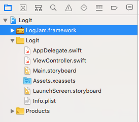

Use the steps from the [Consuming the Framework](#Consuming-the-Framework) section above to embed the new version in the app and recompile it.

<a name="Shipping-an-App-Using-the-Framework"></a>
# Shipping an App Using the Framework

The information for this section came from DZone's article [Creating a Universal Framework in Xcode 9](https://dzone.com/articles/creating-a-universal-framework-in-xcode-9).

Because the custom framework we created contains both the real hardware and simulator versions for iOS, watchOS and tvOS, there is a final step that will need to be done before the app can be submitted to the **iTunes App Store**. This type "Fat Binary" framework will not pass the App Store validation process, so we will need to strip the simulator version from the framework using a shell script provided by the Dzone article.

Select the **Project** in the **Project Navigator**, Select the **Target** and switch to the **Build Phases** tab:

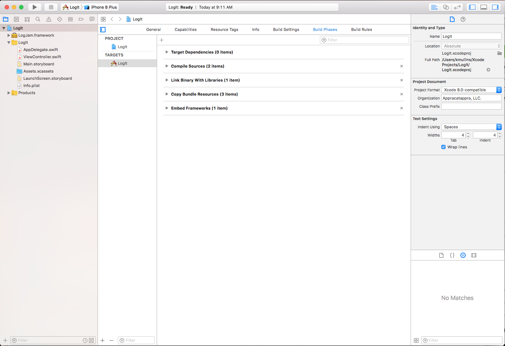

Click the **+** button and select **New Run Script Phase**:

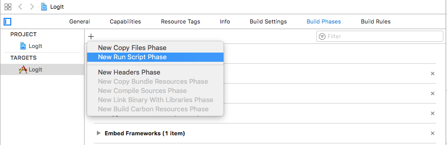

Double-click the name and change it to `Trim Universal Frameworks`:

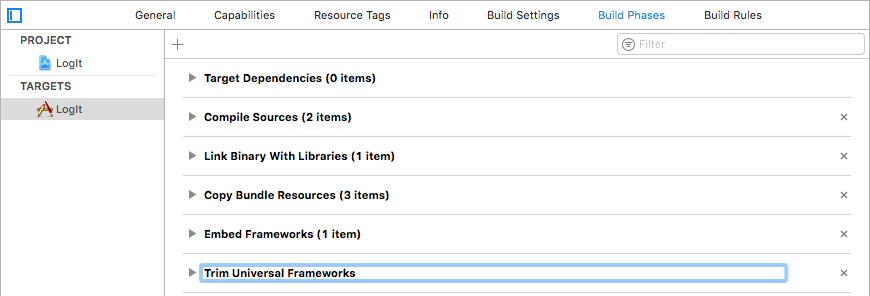

Turndown the **Trim Universal Frameworks** section and add the following shell script:

```sh
FRAMEWORK=$1
echo "Trimming $FRAMEWORK..."
FRAMEWORK_EXECUTABLE_PATH="${BUILT_PRODUCTS_DIR}/${FRAMEWORKS_FOLDER_PATH}/$FRAMEWORK.framework/$FRAMEWORK"
EXTRACTED_ARCHS=()
for ARCH in $ARCHS
do
    echo "Extracting $ARCH..."
    lipo -extract "$ARCH" "$FRAMEWORK_EXECUTABLE_PATH" -o "$FRAMEWORK_EXECUTABLE_PATH-$ARCH"
    EXTRACTED_ARCHS+=("$FRAMEWORK_EXECUTABLE_PATH-$ARCH")
done
echo "Merging binaries..."
lipo -o "$FRAMEWORK_EXECUTABLE_PATH-merged" -create "${EXTRACTED_ARCHS[@]}"
rm "${EXTRACTED_ARCHS[@]}"
rm "$FRAMEWORK_EXECUTABLE_PATH"
mv "$FRAMEWORK_EXECUTABLE_PATH-merged" "$FRAMEWORK_EXECUTABLE_PATH"
echo "Done."
```

Check **Run script only when installing** box and the final result should look something like the following:

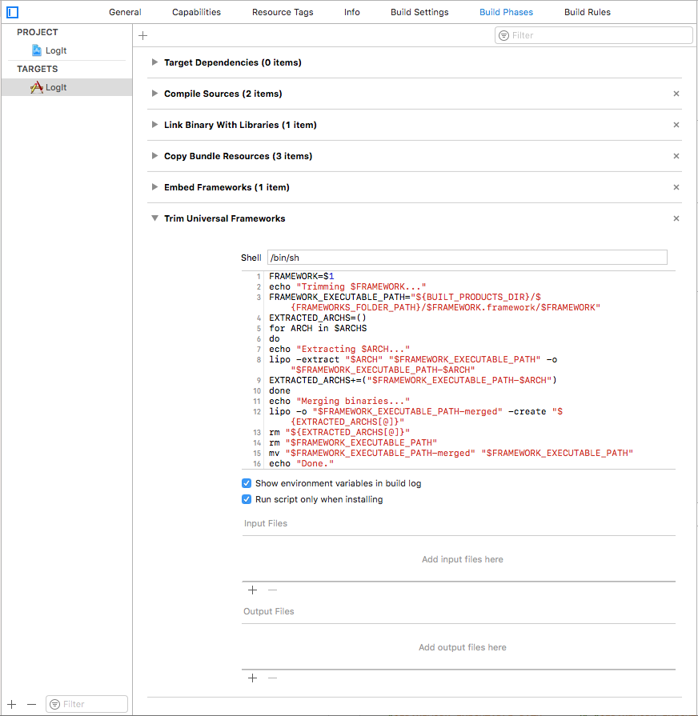

When you build and archive the app for release release, the fat binaries will be stripped and the app can be submitted to the **iTunes App Store**.

<a name="Final-Thoughts"></a>
# Final Thoughts

If you read through all three sections of this article I do hope you found them useful. I'm sure these steps will change when Swift 5 is released later this year (with the hopefully planned ABI stability) and I plan to update these article (or release new versions).

I've open sourced the LogJam project so you can access the final project if you like.