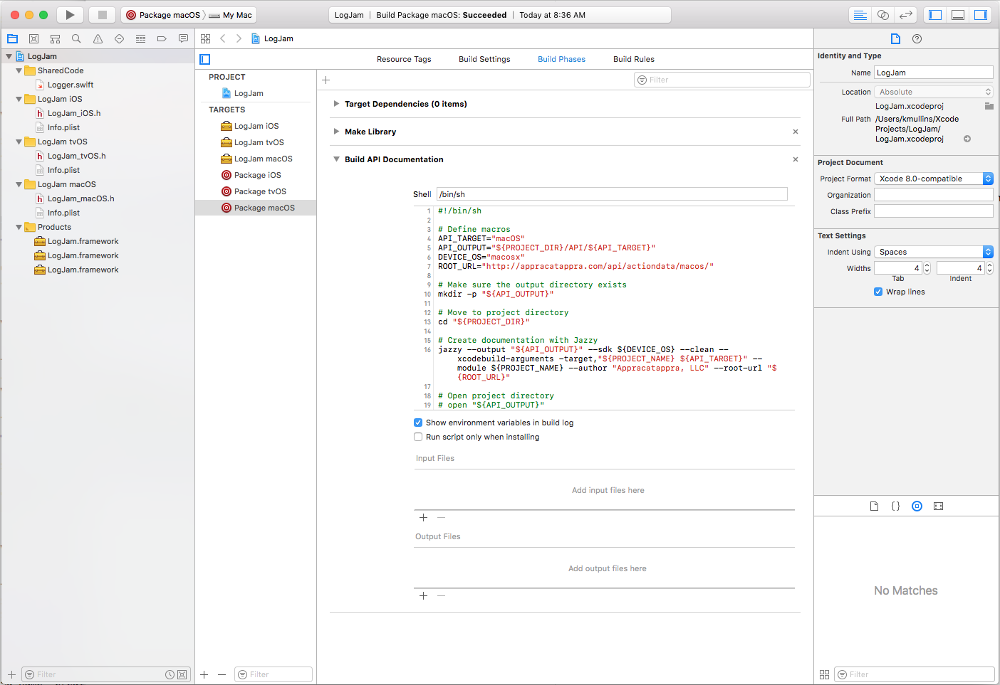

# LogJam

This is a sample cross-platform, Universal Swift 4 Framework for Xcode 9 that belongs to our three part article on the steps Appracatappra uses to create Universal Framework projects in Swift that will support iOS, tvOS, watchOS and macOS, all while sharing as much common code as possible.

 

In the first part, [Building Cross-Platform Universal Frameworks using Swift](http://appracatappra.com/2018/03/building-cross-platform-universal-frameworks-using-swift/), we covered the steps to create the **Universal Framework** project, have it support multiple OSes, share as much code as possible across OSes, build the API documentation for each OS version and include both hardware and simulator support for iOS, watchOS and tvOS frameworks.

The second part, [Cross-Platform Universal Swift Framework Installers](http://appracatappra.com/2018/03/cross-platform-universal-swift-framework-installers/), covers creating an **Installer Package** from our compiled **Universal Frameworks** that includes all of the Apple OSes that the framework supports and placing them in the correct locations in the consumer’s development computer.

The third and final part, [Using Your Custom Cross-Platform Universal Swift Framework](http://appracatappra.com/2018/03/using-your-custom-cross-platform-universal-swift-framework/), covers installing and using our custom cross-platform **Universal Swift Framework** on a consumer’s development computer, updating to new framework version and trimming the “fat binary” framework to release the app to the iTunes App Store.

# MIT License

Copyright © 2018 by [Appracatappra, LLC.](http://appracatappra.com)

--

Permission is hereby granted, free of charge, to any person obtaining a copy of this software and associated documentation files (the "Software"), to deal in the Software without restriction, including without limitation the rights to use, copy, modify, merge, publish, distribute, sublicense, and/or sell copies of the Software, and to permit persons to whom the Software is furnished to do so, subject to the following conditions:

The above copyright notice and this permission notice shall be included in all copies or substantial portions of the Software.

THE SOFTWARE IS PROVIDED "AS IS", WITHOUT WARRANTY OF ANY KIND, EXPRESS OR IMPLIED, INCLUDING BUT NOT LIMITED TO THE WARRANTIES OF MERCHANTABILITY, FITNESS FOR A PARTICULAR PURPOSE AND NONINFRINGEMENT. IN NO EVENT SHALL THE AUTHORS OR COPYRIGHT HOLDERS BE LIABLE FOR ANY CLAIM, DAMAGES OR OTHER LIABILITY, WHETHER IN AN ACTION OF CONTRACT, TORT OR OTHERWISE, ARISING FROM, OUT OF OR IN CONNECTION WITH THE SOFTWARE OR THE USE OR OTHER DEALINGS IN THE SOFTWARE.
